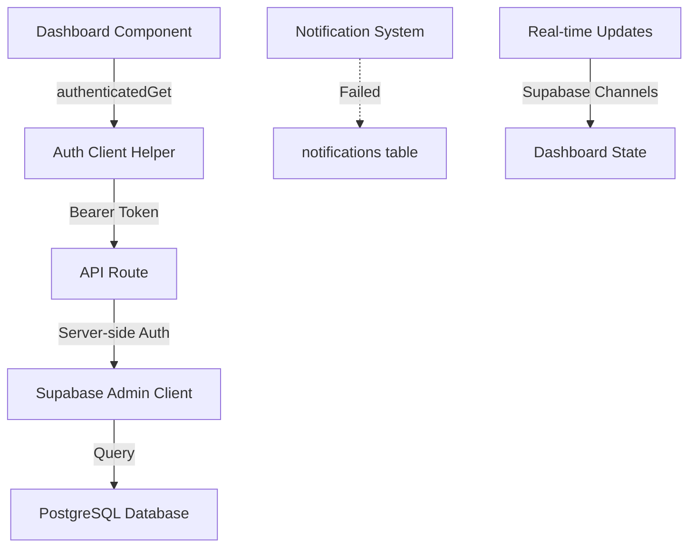

# Dashboard Optimization and Application Completion Design

## Overview

This design addresses critical production readiness gaps across authentication, notifications, dashboard functionality, API integrations, and incomplete features. The objective is to establish a fully functional, production-ready water management application with eight role-specific dashboards, real-time data synchronization, and comprehensive error handling.

## Problem Analysis

### Current State Assessment

#### Authentication Issues
- Missing authentication token# Production Readiness: Dashboard Optimization & System Completion

## Overview

This design addresses critical production readiness issues across Project Aqua's eight role-specific dashboards, notification system, authentication flow, and incomplete functionality. The goal is to ensure all dashboards work correctly with real-time database integration, resolve notification errors, fix authentication issues, and complete missing forms and API endpoints.

---

## Problem Statement

### Current Issues Identified

#### Dashboard-Specific Issues

**1. Data Integration Problems**
- Dashboards use mix of authenticated API calls and direct Supabase queries
- Inconsistent error handling across dashboard components
- Some dashboards showing mock/hardcoded data instead of real database data
- Missing API endpoints for certain dashboard operations

**2. Notification System Failures**
- NotificationCenter component attempts to access non-existent `notifications` table
- Real-time subscription setup fails when table doesn't exist
- Missing notification creation endpoints for system events
- No graceful degradation when notification system is unavailable

**3. Authentication Issues**
- Inconsistent authentication patterns between components
- Missing authorization checks in some API routes
- Token management issues in authenticated requests
- Role-based access control not consistently enforced

**4. Incomplete Functionality**
- AccountsManagerDashboard uses mock invoice and payment data
- ProductManagerDashboard missing complete inventory movement tracking
- ServiceManagerDashboard needs better technician assignment workflow
- Missing API endpoints for specialized manager operations

---

## Affected Dashboards

### Dashboard Inventory

| Dashboard | Role | Current Status | Primary Issues |
|-----------|------|----------------|----------------|
| AdminDashboard | admin | Functional | Relies on /api/admin/stats endpoint |
| ManagerDashboard | manager | Generic Mock Data | Needs role-specific real data |
| AccountsManagerDashboard | accounts_manager | Mock Financial Data | Missing invoices/payments tables & APIs |
| ProductManagerDashboard | product_manager | Partial Integration | Missing inventory movement APIs |
| ServiceManagerDashboard | service_manager | Good Integration | Needs assignment workflow improvement |
| TechnicianDashboard | technician | Good Integration | Working correctly with services API |
| CustomerDashboard | customer | Good Integration | Working correctly with authenticated APIs |
| EnhancedAdminDashboard | admin | Unknown Status | Needs verification |

---

## System Architecture Analysis

### Current Data Flow



### Database Schema Requirements

#### Existing Tables
- users
- customers
- services
- complaints
- products
- service_types
- technicians (view/role filter)

#### Missing Tables
- **invoices** - Financial tracking for accounts manager
- **payments** - Payment records and collection tracking
- **inventory_movements** - Product stock tracking
- **notifications** - System-wide notification storage

---

## Design Solution

### Phase 1: Foundation Fixes

#### A. Authentication Standardization

**Objective**: Ensure consistent, secure authentication across all components and API routes.

**Implementation Strategy**:

1. **Centralized Auth Pattern**
   - All dashboard data fetching must use `authenticatedGet` from auth-client
   - All API routes must verify user session and role
   - Implement middleware pattern for role-based access control

2. **API Route Authentication Flow**
   ```
   Request → Extract Bearer Token → Verify with Supabase → Get User Profile → Check Role Permission → Execute Query → Return Response
   ```

3. **Error Handling Protocol**
   - 401 Unauthorized: Invalid or missing token
   - 403 Forbidden: Valid user but insufficient role permissions
   - 500 Internal Server Error: Database or server issues
   - All errors must include descriptive messages for debugging

#### B. Notification System Fix

**Objective**: Gracefully handle missing notification system and implement proper infrastructure.

**Solution Approach**:

1. **Immediate Fix (Defensive Coding)**
   - Wrap all notification queries in try-catch blocks
   - Check for table existence before querying
   - Provide fallback UI when notifications unavailable
   - Disable real-time subscription if table doesn't exist

2. **Database Migration Strategy**
   - Create notifications table schema
   - Add indexes for user_id and created_at
   - Set up foreign key relationships
   - Create database trigger for notification cleanup

3. **Notification Table Schema**

| Field | Type | Constraints | Description |
|-------|------|-------------|-------------|
| id | uuid | PRIMARY KEY | Unique notification ID |
| user_id | uuid | FOREIGN KEY | Target user reference |
| recipient_role | text | NULLABLE | Broadcast to role |
| title | text | NOT NULL | Notification title |
| message | text | NOT NULL | Notification message |
| type | text | NOT NULL | info, success, warning, error, service, complaint |
| priority | text | DEFAULT 'medium' | low, medium, high, urgent |
| is_read | boolean | DEFAULT false | Read status |
| action_url | text | NULLABLE | Redirect URL |
| related_id | uuid | NULLABLE | Related entity reference |
| metadata | jsonb | NULLABLE | Additional data |
| created_at | timestamp | DEFAULT now() | Creation timestamp |
| read_at | timestamp | NULLABLE | Read timestamp |
| expires_at | timestamp | NULLABLE | Auto-cleanup date |

4. **Notification Creation API**
   - POST /api/notifications - Create new notification
   - POST /api/notifications/mark-read - Mark as read
   - DELETE /api/notifications/[id] - Delete notification
   - GET /api/notifications - Fetch user notifications

---

### Phase 2: Data Integration Completion

#### A. Accounts Manager Dashboard

**Missing Components**:
1. Invoices management system
2. Payment tracking system
3. Financial reporting queries

**Database Schema Requirements**:

**invoices Table**

| Field | Type | Constraints | Description |
|-------|------|-------------|-------------|
| id | uuid | PRIMARY KEY | Unique invoice ID |
| invoice_number | text | UNIQUE, NOT NULL | Human-readable invoice number |
| customer_id | uuid | FOREIGN KEY | Customer reference |
| service_id | uuid | FOREIGN KEY (NULLABLE) | Related service |
| amount | decimal(10,2) | NOT NULL | Invoice amount |
| tax_amount | decimal(10,2) | DEFAULT 0 | Tax/GST amount |
| total_amount | decimal(10,2) | NOT NULL | Total with tax |
| status | text | NOT NULL | pending, paid, overdue, cancelled |
| due_date | date | NOT NULL | Payment due date |
| paid_date | date | NULLABLE | Actual payment date |
| notes | text | NULLABLE | Additional notes |
| created_at | timestamp | DEFAULT now() | Creation timestamp |
| created_by | uuid | FOREIGN KEY | User who created |

**payments Table**

| Field | Type | Constraints | Description |
|-------|------|-------------|-------------|
| id | uuid | PRIMARY KEY | Unique payment ID |
| payment_number | text | UNIQUE, NOT NULL | Payment reference number |
| invoice_id | uuid | FOREIGN KEY | Invoice reference |
| customer_id | uuid | FOREIGN KEY | Customer reference |
| amount | decimal(10,2) | NOT NULL | Payment amount |
| payment_method | text | NOT NULL | cash, card, upi, bank_transfer |
| transaction_id | text | NULLABLE | External transaction reference |
| payment_date | date | NOT NULL | Payment received date |
| notes | text | NULLABLE | Payment notes |
| created_at | timestamp | DEFAULT now() | Record creation |
| created_by | uuid | FOREIGN KEY | User who recorded |

**API Endpoints Required**:
- GET /api/invoices - List invoices with filters
- POST /api/invoices - Create new invoice
- PATCH /api/invoices/[id] - Update invoice
- GET /api/payments - List payments with filters
- POST /api/payments - Record new payment
- GET /api/financial/summary - Financial overview stats

**Dashboard Data Flow**:
```
AccountsManagerDashboard → loadFinancialStats() → GET /api/financial/summary
                        → loadRecentInvoices() → GET /api/invoices?limit=10&sort=created_at
                        → loadPaymentSummary() → GET /api/payments?period=last_7_days
```

#### B. Product Manager Dashboard

**Missing Components**:
1. Real inventory movement tracking
2. Stock alert system
3. Supplier performance metrics

**Database Schema Requirements**:

**inventory_movements Table**

| Field | Type | Constraints | Description |
|-------|------|-------------|-------------|
| id | uuid | PRIMARY KEY | Unique movement ID |
| product_id | uuid | FOREIGN KEY | Product reference |
| movement_type | text | NOT NULL | in, out, adjustment, return |
| quantity | integer | NOT NULL | Quantity moved (positive/negative) |
| previous_stock | integer | NOT NULL | Stock before movement |
| new_stock | integer | NOT NULL | Stock after movement |
| reason | text | NOT NULL | Movement reason |
| reference_id | uuid | NULLABLE | Related entity (service, order) |
| reference_type | text | NULLABLE | Entity type |
| location | text | NULLABLE | Warehouse/location |
| performed_by | uuid | FOREIGN KEY | User who performed |
| timestamp | timestamp | DEFAULT now() | Movement timestamp |
| notes | text | NULLABLE | Additional notes |

**API Endpoints Required**:
- GET /api/inventory/movements - Fetch movement history
- POST /api/inventory/movements - Record new movement
- GET /api/inventory/alerts - Get stock alerts
- POST /api/inventory/restock - Quick restock action
- POST /api/inventory/adjust - Stock adjustment

**Dashboard Data Flow**:
```
ProductManagerDashboard → loadInventoryMovements() → GET /api/inventory/movements?limit=20
                       → loadStockAlerts() → GET /api/inventory/alerts?priority=high,critical
                       → loadProductStats() → GET /api/dashboard/overview?type=product_manager
```

#### C. Service Manager Dashboard

**Enhancement Requirements**:
1. Improved technician assignment workflow
2. Service priority queue management
3. Real-time technician availability tracking

**API Endpoints Required**:
- POST /api/services/assign - Assign service to technician
- GET /api/technicians/available - Get available technicians
- PATCH /api/technicians/[id]/availability - Update availability
- GET /api/services/queue - Get prioritized service queue

**Dashboard Workflow**:
```
ServiceManagerDashboard → View# Production Readiness - Dashboard Optimization & System Completion

## Overview

This design addresses critical gaps preventing the Proj Aqua water management system from achieving production readiness. The analysis reveals incomplete functionality across eight role-specific dashboards, authentication inconsistencies, broken notification systems, and missing API implementations that currently prevent real-time data flow and user interactions.

## Problem Statement

### Current System State

The application contains eight distinct dashboards serving different user roles:
- Admin Dashboard
- Manager Dashboard  
- Service Manager Dashboard
- Accounts Manager Dashboard
- Product Manager Dashboard
- Technician Dashboard
- Customer Dashboard
- Driver Dashboard

### Critical Issues Identified

#### Authentication & Authorization Gaps
- Inconsistent authentication patterns across dashboards (some use `useAuth`, others use `useAuthContext`)
- Missing authentication verification in multiple API routes
- No unified session management strategy
- Authorization checks incomplete for role-based access control

#### Notification System Failures
- Notification Center component attempts to access non-existent database table
- Real-time subscriptions configured but no database schema exists
- API endpoints return 404 or table not found errors
- No fallback mechanism when notifications fail

#### Dashboard Data Integration Problems
- Dashboards use mix of mock data and real API calls
- Inconsistent data fetching patterns (direct Supabase calls vs. authenticated API requests)
- No error boundaries for failed API calls
- Missing loading states cause UI flicker
- Stats calculations happen client-side with hardcoded values instead of server aggregations

#### Incomplete Forms & User Actions
- Service Request Form references non-existent tables (customer_products, service_requests)
- Complaint Form submitted but no follow-up workflow
- Product Registration Form accesses missing database tables (product_catalog, customer_products, product_subscriptions)
- Form submissions succeed but data not retrievable

#### Missing API Implementations
- `/api/admin/stats` returns incomplete data structure
- `/api/dashboard/stats` missing role-specific calculations
- `/api/dashboard/overview` has hardcoded mock responses for Product Manager
- `/api/inventory` endpoint referenced but not implemented
- `/api/technicians` returns empty or incomplete data

## Strategic Design

### Authentication Unification Strategy

#### Objective
Establish a single, consistent authentication pattern across all components to ensure reliable user identity verification and role-based access control.

#### Approach

**Centralized Auth Context**
- Consolidate `useAuth` hook and `AuthContext` into a single source of truth
- Ensure all components access user state through the unified context
- Maintain session state with automatic refresh handling
- Provide role-checking utilities at the context level

**API Authentication Standard**
- All API routes must validate requests using server-side Supabase client
- Extract user from JWT token in Authorization header
- Return 401 for unauthenticated requests
- Return 403 for unauthorized role access
- Consistent error response structure across all endpoints

**Client-Side Request Pattern**
- All dashboard data fetching must use `authenticatedGet` helper
- Forms must use `authenticatedPost` for submissions
- Handle authentication errors gracefully with user feedback
- Retry logic for transient auth failures

#### Outcome
Every dashboard and form will have verified user identity before rendering sensitive data or accepting actions.

---

### Notification System Redesign

#### Objective
Provide reliable real-time notifications to all user roles with proper database schema, fallback mechanisms, and error handling.

#### Database Schema Requirements

**Notifications Table Structure**
- Primary key (UUID)
- Recipient identification (user_id, role-based targeting)
- Notification content (title, message, type, priority)
- Read status tracking (is_read, read_at timestamp)
- Action metadata (action_url, related entity IDs)
- Expiration handling (expires_at)
- Timestamps (created_at, updated_at)

**Real-time Subscription Configuration**
- Supabase Realtime enabled on notifications table
- Row-level security policies for user isolation
- INSERT, UPDATE triggers for notification delivery
- Broadcast channels for role-based notifications

#### Component Behavior

**Notification Center**
- Check table existence before querying
- Graceful degradation if notifications unavailable
- Display meaningful empty state
- Polling fallback if WebSocket fails
- Browser notification permission handling

**Notification Hook (useNotifications)**
- Return empty array when service unavailable
- Maintain unread count in local state
- Debounce real-time updates
- Error boundary for subscription failures

**API Endpoints**
- GET `/api/notifications` - fetch user notifications with pagination
- POST `/api/notifications` - create notification (admin/manager only)
- PATCH `/api/notifications/mark-read` - mark as read
- DELETE `/api/notifications/[id]` - remove notification

#### Outcome
Users receive timely system notifications without application crashes when notification service is unavailable.

---

### Dashboard Data Integration Architecture

#### Objective
Ensure all eight dashboards display real-time, accurate data pulled from the database with consistent loading patterns and error handling.

#### Data Fetching Strategy

**Server-Side Data Aggregation**
- Move all stats calculations to dedicated API endpoints
- Compute totals, averages, status breakdowns on server
- Return pre-aggregated data to minimize client processing
- Cache frequently accessed metrics with appropriate TTL

**API Route Structure**

| Endpoint | Purpose | Data Returned |
|----------|---------|---------------|
| `/api/dashboard/stats` | Role-specific statistics | Totals, counts, percentages based on user role |
| `/api/dashboard/overview` | Activity feed and trends | Recent actions, service trends, priority breakdowns |
| `/api/admin/stats` | System-wide metrics | User counts, role distribution, complaint stats |
| `/api/services` | Service request data | Filtered by role - customer sees own, manager sees all |
| `/api/complaints` | Complaint records | Filtered by role with full details |
| `/api/technicians` | Technician availability | Active technicians, capacity, performance metrics |
| `/api/inventory` | Product stock levels | Current inventory, low stock alerts, movement history |

**Dashboard Loading Pattern**
1. Component mounts with loading state
2. Fetch data using authenticated API calls in parallel
3. Display skeleton UI during load
4. Render data when available
5. Show error UI if fetch fails
6. Provide manual refresh capability
7. Auto-refresh on interval (30-60 seconds)

**Error Handling**
- Network errors display retry button
- Authorization errors redirect to login
- Data errors show empty state with context
- Partial failures still render available data
- Error logs sent to console for debugging

#### Role-Specific Dashboard Implementations

**Admin Dashboard**
- Stats: total users, active services, open complaints, system health
- Data sources: aggregated counts from users, services, complaints tables
- Actions: user management, system configuration, reports
- Real-time: new user registrations, critical complaints

**Service Manager Dashboard**
- Stats: pending services, in-progress jobs, available technicians, emergency requests
- Data sources: services table filtered by status, users table for technicians
- Actions: assign technicians, prioritize services, view service details
- Real-time: new service requests, technician status changes

**Accounts Manager Dashboard**
- Stats: revenue totals, pending payments, collection rate, overdue accounts
- Data sources: invoices table, payments table, financial transactions
- Actions: generate invoices, send payment reminders, view aging report
- Real-time: payment confirmations, invoice generations

**Product Manager Dashboard**
- Stats: total products, stock levels, low stock alerts, inventory value
- Data sources: product_catalog, inventory table, stock_movements
- Actions: add products, adjust inventory, restock orders
- Real-time: inventory changes, low stock alerts

**Technician Dashboard**
- Stats: assigned jobs, in-progress tasks, completed today, rating
- Data sources: services table filtered by assigned_technician
- Actions: start job, update status, complete service, view details
- Real-time: new assignments, job updates

**Customer Dashboard**
- Stats: active services, completed services, open complaints, spending
- Data sources: services and complaints filtered by customer_id
- Actions: request service, file complaint, view history
- Real-time: service status updates, complaint responses

**Manager Dashboard**
- Stats: team performance, active projects, budget status
- Data sources: depends on manager type (service/accounts/product)
- Actions: department-specific management tools
- Real-time: team updates, priority alerts

**Driver Dashboard**
- Stats: delivery assignments, completed deliveries, route efficiency
- Data sources: delivery_schedules, delivery_logs
- Actions: update delivery status, view routes, confirm deliveries
- Real-time: new delivery assignments, route changes

#### Outcome
All dashboards display live, accurate data from the database with graceful error handling and consistent user experience.

---

### Form Completion & Workflow Implementation

#### Objective
Complete all user-facing forms with proper database integration, validation, and post-submission workflows.

#### Service Request Form

**Database Requirements**
- Table: `service_requests` or use existing `services` table
- Required fields: customer_id, service_type, description, priority, contact_phone, address
- Optional fields: preferred_date, time_slot, product_id, estimated_cost

**Submission Workflow**
1. Validate form fields client-side
2. Generate unique service request number
3. Submit to `/api/services` POST endpoint
4. Create service record with status "pending"
5. Trigger notification to service managers
6. Return confirmation with request number
7. Redirect to tracking page or dashboard

**Post-Submission Actions**
- Email confirmation to customer
- SMS notification for emergency requests
- Assignment workflow triggers for managers
- Update customer's service history

#### Complaint Form

**Database Requirements**
- Table: `complaints` (already exists)
- Required fields: customer_id, title, description, category, priority
- Optional fields: location, phone, related_service_id

**Submission Workflow**
1. Validate complaint details
2. Generate complaint number
3. Submit to `/api/complaints` POST endpoint
4. Create complaint record with status "open"
5. Route to appropriate department based on category
6. Notify managers of new complaint
7. Return complaint number to customer

**Post-Submission Actions**
- Auto-assign to department based on category
- Email acknowledgment to customer
- Add to manager's complaint queue
- Track resolution SLA based on priority
- Create activity log entry

#### Product Registration Form

**Database Requirements**
- Table: `customer_products` for linking customers to products
- Table: `product_subscriptions` for AMC/CMC contracts
- Required fields: customer_id, product_id, serial_number, installation_date, address
- Optional fields: technician_id, warranty_end_date

**Submission Workflow**
1. Verify serial number uniqueness
2. Validate product exists in catalog
3. Create customer_product record
4. Calculate warranty end date
5. If subscription selected, create subscription record
6. Schedule first service if AMC/CMC
7. Generate warranty certificate
8. Update product status to "deployed"

**Post-Submission Actions**
- Email warranty certificate to customer
- SMS with product registration confirmation
- Add to customer's product list
- Schedule first service call
- Create calendar reminders for service due dates

#### Outcome
All forms submit successfully to the database with complete workflows triggering appropriate follow-up actions.

---

### API Implementation Completeness

#### Objective
Implement all missing API endpoints to support dashboard functionality and form submissions.

#### Required API Endpoints

**Inventory Management**
- `GET /api/inventory` - Fetch product inventory with stock levels
- `POST /api/inventory` - Create new inventory item
- `PATCH /api/inventory` - Update stock levels (restock, adjustment)
- Response structure: products array, low stock alerts, total inventory value

**Technician Management**
- `GET /api/technicians` - Fetch technician list with availability
- Response includes: technician details, active jobs count, completed today, rating
- Filter by availability status
- Include workload calculation for assignment optimization

**Admin Statistics**
- `GET /api/admin/stats` - Comprehensive system statistics
- Return: user counts by role, service status distribution, complaint metrics
- Calculate growth percentages (compare to previous period)
- Include role breakdown for user management

**Dashboard Stats Enhancement**
- `GET /api/dashboard/stats?user_id=X&role=Y` - Enhanced role-specific stats
- Customer: my services count, complaints, total spent
- Technician: assigned jobs, completion rate, today's tasks
- Manager: department metrics, team performance, pending approvals
- Admin: system-wide overview, recent activity, alerts

**Service Assignment**
- `POST /api/services/assign` - Assign service to technician
- Validate technician availability
- Check workload capacity
- Update service status to "assigned"
- Notify technician of new assignment
- Create assignment log entry

**Product & Subscription Management**
- `GET /api/products` - Product catalog with pricing
- `POST /api/products` - Add new product to catalog
- `GET /api/subscriptions` - Customer subscription list
- `POST /api/subscriptions` - Create AMC/CMC subscription
- `PATCH /api/subscriptions` - Update subscription status

#### API Response Standardization

**Success Response Format**
```
{
  "success": true,
  "data": { ... },
  "message": "Operation completed successfully",
  "timestamp": "2024-01-22T10:30:00Z"
}
```

**Error Response Format**
```
{
  "success": false,
  "error": "Error message",
  "code": "ERROR_CODE",
  "details": { ... },
  "timestamp": "2024-01-22T10:30:00Z"
}
```

**Pagination Pattern**
```
{
  "success": true,
  "data": [ ... ],
  "pagination": {
    "page": 1,
    "limit": 50,
    "total": 250,
    "hasMore": true
  }
}
```

#### Outcome
All dashboards and forms have complete API support with consistent response formats and proper error handling.

---

### Database Schema Completion

#### Objective
Ensure all tables referenced by forms and dashboards exist with proper relationships and constraints.

#### Required Tables

**Notifications Table**
- Purpose: Store user notifications for real-time updates
- Fields: id, user_id, role, title, message, type, priority, is_read, action_url, created_at, expires_at
- Indexes: user_id, is_read, created_at
- RLS Policy: Users can only see their own notifications

**Service Requests Table (if separate from services)**
- Purpose: Track customer service requests before conversion to services
- Fields: id, request_number, customer_id, service_type_id, priority, preferred_date, time_slot, problem_description, status
- Relationships: customer_id → customers, service_type_id → service_types
- Status flow: pending → approved → converted_to_service

**Customer Products Table**
- Purpose: Link customers to their installed products
- Fields: id, customer_id, product_id, serial_number, installation_date, installation_address, warranty_end_date, status
- Relationships: customer_id → customers, product_id → product_catalog
- Unique constraint: serial_number

**Product Subscriptions Table**
- Purpose: Manage AMC/CMC contracts
- Fields: id, customer_product_id, subscription_type, plan_name, start_date, end_date, amount, service_frequency, next_service_due, status
- Relationships: customer_product_id → customer_products
- Constraints: start_date < end_date

**Inventory Table**
- Purpose: Track product stock levels
- Fields: id, product_id, current_stock, min_stock_level, max_stock_level, reorder_point, unit_price, last_restocked
- Relationships: product_id → product_catalog
- Constraints: current_stock >= 0

**Stock Movements Table**
- Purpose: Audit trail for inventory changes
- Fields: id, product_id, movement_type (in/out/adjustment), quantity, reason, user_id, timestamp
- Relationships: product_id → inventory, user_id → users

**Invoices Table**
- Purpose: Financial billing records
- Fields: id, invoice_number, customer_id, amount, status, due_date, payment_date, created_at
- Relationships: customer_id → customers
- Status values: pending, paid, overdue, cancelled

**Delivery Schedules Table**
- Purpose: Driver# Production Readiness: Complete Dashboard and System Fixes

## Context and Scope

This design addresses critical gaps preventing the Proj Aqua application from achieving production readiness. Through comprehensive analysis, multiple incomplete implementations, authentication issues, and missing API endpoints have been identified across the 8 role-specific dashboards and core system functionality.

### Identified Critical Issues

**Dashboard Data Flow Issues:**
- ManagerDashboard, AccountsManagerDashboard, ProductManagerDashboard, and ServiceManagerDashboard use hardcoded mock data instead of real database queries
- Inconsistent use of authenticated API calls across dashboards
- Missing real-time data synchronization in several dashboards

**Authentication and Authorization Gaps:**
- Notifications API lacks proper user-role filtering and unread count tracking
- Missing authentication verification in several API routes
- Inconsistent session management across dashboard components

**Incomplete Forms and Features:**
- Service request forms reference non-existent database tables (service_requests, customer_products)
- Product registration forms reference missing tables (product_catalog, product_subscriptions)
- Complaint forms lack backend integration for submission
- Missing API endpoints for critical operations

**Notification System Issues:**
- Real-time notification subscription mechanism exists but database integration is incomplete
- Mark-as-read functionality present but not properly integrated with notification count
- Missing notification creation triggers for service assignments and status changes

## Objectives

Achieve full production readiness by:

1. Completing all dashboard data integrations with live database queries
2. Implementing missing API endpoints for forms and data operations
3. Resolving authentication and authorization inconsistencies
4. Establishing comprehensive real-time notification system
5. Ensuring all 8 dashboards function correctly with role-based data access
6. Validating database schema completeness for all features

## System Architecture Overview

### Dashboard Ecosystem

The application implements 8 role-specific dashboards, each requiring distinct data access patterns and features:

| Dashboard | Current Status | Primary Issues |
|-----------|---------------|----------------|
| AdminDashboard | Functional | Uses authenticated API correctly, needs enhanced stats endpoint |
| ManagerDashboard | Incomplete | Hardcoded stats, no real data fetching |
| CustomerDashboard | Functional | Working with authenticated APIs, good implementation |
| TechnicianDashboard | Functional | Real-time job fetching works correctly |
| AccountsManagerDashboard | Incomplete | All financial data is mocked, no database integration |
| ProductManagerDashboard | Incomplete | Inventory stats and alerts are mocked |
| ServiceManagerDashboard | Incomplete | Service counts and technician data mocked |
| EnhancedAdminDashboard | Incomplete | Referenced but implementation needs verification |

### Data Access Architecture

**Current Implementation Pattern:**
```
Component → authenticatedGet() → API Route → Supabase Admin Client → Database
```

**Authentication Flow:**
```
User Session → JWT Token → Authorization Header → API Validation → Role Check → Data Filtering
```

## Critical Feature Gaps

### Database Schema Gaps

Based on form implementations referencing non-existent tables:

**Missing Tables:**

1. **service_requests** - Referenced by ServiceRequestForm
   - Expected fields: request_number, customer_id, customer_product_id, service_type_id, priority, preferred_date, preferred_time_slot, customer_address, contact_phone, problem_description, customer_notes, source, status, estimated_cost

2. **customer_products** - Referenced by ProductRegistrationForm and ServiceRequestForm
   - Expected fields: id, customer_id, product_id, serial_number, installation_date, installation_address, installation_technician_id, warranty_end_date, status

3. **product_catalog** - Referenced by ProductRegistrationForm
   - Expected fields: id, product_code, product_name, category, brand, model, description, base_price, warranty_months, status

4. **product_subscriptions** - Referenced by ProductRegistrationForm
   - Expected fields: id, customer_product_id, subscription_type, plan_name, start_date, end_date, amount, services_included, service_frequency, status, next_service_due, total_services_allowed, services_completed, created_by

5. **Notifications table enhancement** - Partially exists but needs fields:
   - recipient_role field for role-based notifications
   - read_at timestamp for tracking
   - unread_count tracking mechanism

### Missing API Endpoints

**High Priority Endpoints:**

1. **GET /api/dashboard/stats**
   - Purpose: Role-based dashboard statistics
   - Current: Endpoint exists but returns incomplete data for some roles
   - Needed: Enhanced stats for accounts_manager and product_manager roles

2. **POST /api/inventory**
   - Purpose: Inventory management operations (restock, adjust, alerts)
   - Current: Missing
   - Required for: ProductManagerDashboard

3. **GET /api/inventory**
   - Purpose: Fetch inventory data, stock alerts, movements
   - Current: Missing
   - Required for: ProductManagerDashboard

4. **POST /api/service-requests**
   - Purpose: Create service requests from customer portal
   - Current: Missing (services API exists but different schema)
   - Required for: ServiceRequestForm submission

5. **GET /api/notifications/unread-count**
   - Purpose: Get unread notification count for badge display
   - Current: Missing
   - Required for: NotificationDropdown component

6. **POST /api/notifications/bulk-create**
   - Purpose: Create notifications for service assignments, status changes
   - Current: Missing
   - Required for: Automated notification triggers

### Form Submission Gaps

**ServiceRequestForm Issues:**
- References service_requests table (not in schema)
- Current services table has different structure
- Need: Either adapt form to existing services table OR create service_requests table and migration logic

**ProductRegistrationForm Issues:**
- References product_catalog, customer_products, product_subscriptions tables
- None exist in current schema
- Need: Database migration to create these tables with proper relationships

**ComplaintForm Issues:**
- Form is complete but submission logic may need validation
- Backend API exists but needs testing with complete flow

## Solution Design

### Phase 1: Database Schema Completion

**Approach Decision:**

Option A: Create new tables as referenced by forms
Option B: Adapt forms to use existing tables

**Recommended: Option A** - Create new tables to maintain separation of concerns and support future feature expansion.

**Database Migration Strategy:**

Create migration scripts for:

1. **service_requests table**
   - Separate from services table to distinguish customer requests from actual service records
   - Relationship: One service_request can generate one service entry when approved
   - Status flow# Dashboard Optimization & Production Readiness

## Project Context

Project Aqua is a comprehensive water management system built with Next.js, TypeScript, Supabase, and Tailwind CSS. The application features 8 role-based dashboards serving different user types: Admin, Service Manager, Accounts Manager, Product Manager, Technician, Customer, Driver, and Manager. The current implementation has several incomplete functionalities, authentication inconsistencies, notification system issues, and data fetching problems that prevent the application from being production-ready.

## Problem Statement

The application contains multiple critical issues across various functional areas:

### Authentication & Authorization Issues
- Inconsistent authentication state management across dashboard components
- Mixed usage of `useAuth` hook and `useAuthContext` leading to potential state synchronization issues
- Authorization token handling inconsistencies in API route protection
- Session validation gaps in certain protected routes
- Role-based access control enforcement missing in several components

### Notification System Problems
- Notification center fails to load when notifications table doesn't exist
- Real-time subscription setup lacks proper error handling
- Unread count calculation errors when notifications are empty
- Mark as read functionality doesn't update local state consistently
- Missing notification API endpoints for certain dashboard operations
- Browser notification permission handling incomplete

### Dashboard Data Fetching Issues
- Manager Dashboard uses hardcoded mock statistics instead of real data
- Accounts Manager Dashboard relies entirely on mock financial data
- Product Manager Dashboard stats API integration incomplete
- Service Manager Dashboard missing real-time service assignment updates
- Customer Dashboard stats endpoint returns inconsistent data structure
- EnhancedAdminDashboard has unused data fetching logic

### Incomplete Forms & Features
- Service Request Form lacks backend integration validation
- Complaint Form submission doesn't trigger notification creation
- Product Registration Form missing subscription activation workflow
- Missing error recovery mechanisms in form submissions
- Incomplete data validation across multiple forms
- No loading state management during async operations

### API Route Incompleteness
- Dashboard stats API returns incomplete data structures
- Missing API endpoints for notification preferences
- Inventory management API lacks stock adjustment workflows
- Service assignment API doesn't update technician availability
- Complaint resolution workflow endpoints missing
- Export functionality in admin routes incomplete

### Database Integration Gaps
- Inconsistent database schema assumptions across components
- Missing foreign key relationship handling in API responses
- Incomplete error handling for database constraint violations
- Real-time subscription cleanup not properly implemented
- Missing database indexes for performance-critical queries

## Strategic Goals

### Immediate Priorities

**Data Consistency & Integrity**
- Establish single source of truth for all dashboard statistics
- Implement consistent data fetching patterns across all dashboards
- Ensure real-time data synchronization through Supabase subscriptions
- Validate database schema compatibility with all components

**Authentication Standardization**
- Consolidate authentication logic into unified hooks and context
- Implement consistent session validation across all protected routes
- Standardize API request authentication patterns
- Ensure role-based access control at both UI and API layers

**Notification System Completion**
- Implement graceful degradation when notifications table doesn't exist
- Complete real-time notification delivery pipeline
- Build notification preference management system
- Integrate notification triggers across all business workflows

**Production Readiness**
- Complete all incomplete forms with full backend integration
- Implement comprehensive error handling and recovery mechanisms
- Add proper loading states and user feedback throughout application
- Ensure all API endpoints return consistent data structures

### Long-term Objectives

**Performance Optimization**
- Implement data caching strategies for frequently accessed information
- Optimize database queries with proper indexing
- Reduce unnecessary re-renders in dashboard components
- Implement lazy loading for non-critical dashboard sections

**Monitoring & Observability**
- Add error tracking and reporting mechanisms
- Implement application performance monitoring
- Create audit logs for critical business operations
- Build admin dashboard for system health monitoring

**Scalability & Maintainability**
- Establish consistent code patterns across all modules
- Document data flow and state management approaches
- Create reusable components for common dashboard patterns
- Implement automated testing for critical workflows

## Architectural Approach

### Authentication Architecture

**Unified Authentication Layer**

The authentication system requires consolidation into a single, reliable pattern:

- Create a master authentication context that serves as the single source of truth for user state, session management, and role information
- Deprecate duplicate authentication hooks and migrate all components to use the unified context
- Implement middleware-level authentication validation for all protected routes
- Establish consistent token handling in both client-side and server-side API requests

**Session Management**

- Implement automatic session refresh mechanisms to prevent unexpected logouts
- Add session validation checks at critical transaction points
- Create session recovery workflows for interrupted operations
- Implement proper cleanup on logout and session expiration

**Role-Based Access Control**

- Centralize role permission definitions in a single configuration
- Implement permission checking utilities accessible throughout the application
- Add role validation at both route level and component level
- Create permission-denied handling with appropriate user feedback

### Data Fetching & State Management

**Dashboard Data Architecture**

Each dashboard requires a consistent data fetching pattern:

- Create dedicated API endpoints for each dashboard type returning complete data structures
- Implement a standardized response format across all dashboard APIs
- Use React Query or SWR for data caching, automatic refetching, and state management
- Establish loading states, error states, and empty states for all data displays

**Real-time Data Synchronization**

- Implement Supabase real-time subscriptions for time-sensitive data
- Create subscription management utilities to handle connection lifecycle
- Add fallback mechanisms when real-time updates fail
- Implement optimistic UI updates for improved perceived performance

**Data Validation & Transformation**

- Validate all API responses against expected schemas
- Transform database responses into consistent frontend data models
- Handle null, undefined, and missing data gracefully
- Implement data sanitization for user-generated content

### Notification System Architecture

**Notification Infrastructure**

The notification system requires a complete implementation:

- Create notification generation service that can be triggered from any business workflow
- Implement notification delivery queue for reliable message delivery
- Build notification preference management for user-customizable alerts
- Add notification history and archival mechanisms

**Real-time Notification Delivery**

- Establish Supabase real-time channels for instant notification delivery
- Implement browser push notification integration
- Create notification batching for high-frequency events
- Add notification sound and visual alerts with user preferences

**Notification Integration Points**

Integrate notification triggers into these workflows:
- Service request creation and status updates
- Complaint filing and resolution
- Product registration and warranty updates
- Subscription renewals and expirations
- Payment processing and invoice generation
- Task assignments and completions
- System alerts and maintenance notifications

### Form & Workflow Completion

**Form Validation Architecture**

Implement comprehensive validation at multiple levels:

- Client-side validation for immediate user feedback
- Schema-based validation using libraries like Zod or Yup
- Server-side validation before database operations
- Business rule validation for complex workflows

**Form Submission Workflow**

Each form requires a complete submission pipeline:

- Pre-submission validation and confirmation
- Loading state management during async operations
- Error handling with specific, actionable error messages
- Success confirmation with appropriate next actions
- Post-submission cleanup and state reset

**Backend Integration**

Complete the backend integration for all forms:

- Service Request Form: Validate service type availability, check technician capacity, create service record, generate notifications
- Complaint Form: Validate complaint categorization, create complaint record, assign to appropriate handler, trigger notification workflow
- Product Registration Form: Validate serial numbers, check product catalog, create customer product record, activate subscriptions, generate warranty records

### API Layer Enhancement

**Endpoint Standardization**

All API endpoints must follow consistent patterns:

- Standardize request/response structures across all endpoints
- Implement consistent error response formats
- Add proper HTTP status codes for all scenarios
- Include pagination, filtering, and sorting capabilities where appropriate

**Dashboard Stats APIs**

Complete implementation for all dashboard types:

- Admin Dashboard: User counts, role breakdown, recent activity, system health metrics
- Service Manager Dashboard: Service counts by status, technician availability, emergency requests, completion rates
- Accounts Manager Dashboard: Revenue metrics, payment status, aging reports, collection rates
- Product Manager Dashboard: Inventory levels, stock alerts, movement history, supplier performance
- Technician Dashboard: Assigned jobs, completion stats, rating information
- Customer Dashboard: Service history, complaint status, subscription details, payment history

**Data Aggregation & Performance**

- Implement database views for complex aggregations
- Create materialized views for frequently accessed statistics
- Add database indexes for query optimization
- Implement caching strategies for expensive calculations

### Error Handling & User Experience

**Error Handling Strategy**

Implement comprehensive error handling:

- Network error handling with retry mechanisms
- Database error handling with user-friendly messages
- Validation error display with field-level feedback
- Session expiration handling with automatic recovery

**Loading States**

Provide clear feedback during operations:

- Skeleton loaders for dashboard components
- Inline spinners for button actions
- Progress indicators for multi-step operations
- Optimistic UI updates for perceived performance

**Empty States**

Design meaningful empty states:

- First-time user guidance
- No-data scenarios with actionable prompts
- Filter result empty states with reset options
- Error recovery suggestions

## Implementation Priorities

### Phase 1: Critical Fixes

**Priority Level: Urgent**

These issues prevent basic functionality and must be resolved immediately:

1. Authentication Consolidation
   - Migrate all components to use unified authentication context
   - Fix session validation in protected routes
   - Standardize API authentication headers
   - Test role-based access control across all dashboards

2. Notification System Stabilization
   - Add graceful fallback when notifications table doesn't exist
   - Fix real-time subscription error handling
   - Implement mark-as-read state synchronization
   - Add notification creation triggers for critical workflows

3. Dashboard Data Integration
   - Replace mock data with real API calls in all dashboards
   - Complete dashboard stats API endpoints
   - Fix data structure inconsistencies
   - Implement error handling for failed data fetches

### Phase 2: Feature Completion

**Priority Level: High**

These features are partially implemented and need completion:

1. Form Backend Integration
   - Complete Service Request Form submission workflow
   - Add Complaint Form notification triggers
   - Implement Product Registration subscription activation
   - Add comprehensive validation across all forms

2. API Endpoint Completion
   - Implement missing notification preference endpoints
   - Complete inventory management workflows
   - Add service assignment technician availability updates
   - Build complaint resolution workflow endpoints

3. Real-time Data Synchronization
   - Implement Supabase subscriptions for live updates
   - Add subscription cleanup on component unmount
   - Create reconnection logic for interrupted connections
   - Test concurrent user update scenarios

### Phase 3: Production Hardening

**Priority Level: Medium**

These enhancements improve reliability and user experience:

1. Comprehensive Error Handling
   - Add retry logic for transient failures
   - Implement error boundary components
   - Create user-friendly error messages
   - Add error reporting and logging

2. Loading States & UX Polish
   - Implement skeleton loaders throughout
   - Add optimistic UI updates
   - Create meaningful empty states
   - Improve form validation feedback

3. Performance Optimization
